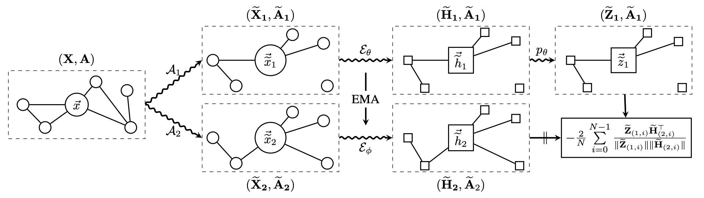

# Bootstrapped Representation Learning on Graphs



This is the PyTorch implementation of BGRL 
`Bootstrapped Representation Learning on Graphs`

The main scripts are `train_transductive.py` and `train_ppi.py` 
used for training on the transductive task datasets
and the PPI dataset respectively.

For linear evaluation, using the checkpoints we provide 

### Setup

To set up a Python virtual environment with the required dependencies, run:
```
python3 -m venv bgrl_env
source bgrl_env/bin/activate
pip install --upgrade pip
```

Follow instructions to install 
[PyTorch 1.9.1](https://pytorch.org/get-started/locally/) and 
[PyG](https://pytorch-geometric.readthedocs.io/en/latest/notes/installation.html):
```
pip install torch==1.9.1+cu111 -f https://download.pytorch.org/whl/torch_stable.html
pip install torch-scatter torch-sparse torch-cluster torch-spline-conv torch-geometric -f https://data.pyg.org/whl/torch-1.9.0+cu111.html
pip install absl-py==0.12.0 tensorboard==2.6.0 ogb
```

The code uses PyG (PyTorch Geometric).
All datasets are available through this package.


## Experiments on transductive tasks

### Train model from scratch
To run BGRL on a dataset from the transductive setting, use `train_transductive.py` 
and one of the configuration files that can be found in `config/`. 

For example, to train on the Coauthor-CS dataset, use the following command:
```bash
python3 train_transductive.py --flagfile=config/coauthor-cs.cfg
```

Flags can be overwritten:
```bash
python3 train_transductive.py --flagfile=config/coauthor-cs.cfg\
                              --logdir=./runs/coauthor-cs-256\
                              --predictor_hidden_size=256
```

Evaluation is performed periodically during training. We fit a logistic regression model
on top of the representation to assess its performance throughout training. 
Evaluation is triggered every `eval_epochs`and will not back-propagate any gradient to the encoder.

Test accuracies under linear evaluation are reported on TensorBoard. 
To start the tensorboard server run the following command:
```bash
tensorboard --logdir=./runs
```

### Perform linear evaluation using the provided model weights
The configuration files we provide allow to reproduce the results in the paper, 
summarized in the table below. We also provide weights of the BGRL-trained 
encoders for each dataset.

| | WikiCS | Amazon Computers | Amazon Photos | CoauthorCS | CoauthorPhy |
|----|----|----|----|----|----|
|BGRL| 79.98 ± 0.10 <br /> ([weights](./weights/bgrl-wikics.pt)) | 90.34 ± 0.19 <br /> ([weights](./weights/bgrl-amazon-computers.pt))|93.17 ± 0.30 <br /> ([weights](./weights/bgrl-amazon-photos.pt))|93.31 ± 0.13 <br /> ([weights](./weights/bgrl-coauthor-cs.pt))|95.73 ± 0.05 <br /> ([weights](./weights/bgrl-coauthor-physics.pt))|


To run linear evaluation, using the provided weights, run the following command for any of the datasets:
```bash
python3 linear_eval_transductive.py --flagfile=config-eval/coauthor-cs.cfg
```

Note that the dataset is split randomly between train/val/test, so the reported accuracy might be slightly 
different with each run. In our reported table, we average across multiple splits, as well as multiple 
randomly initialized network weights.


## Experiments on inductive task with multiple graphs
To train on the PPI dataset, use `train_ppi.py`:
```bash
python3 train_ppi.py --flagfile=config/ppi.cfg
```

The evaluation for PPI is different due to the size of the dataset, we evaluate by training
a linear layer on top of the representations via gradient descent 
for 100 steps.

The configuration files for the different architectures can be found in `config/`. 
We provide weights of the BGRL-trained encoder as well.

| | PPI | 
|----|----|
|BGRL|69.41 ± 0.15 ([weights](./weights/bgrl-ppi.pt))|

To run linear evaluation, using the provided weights, run the following command:
```bash
python3 linear_eval_ppi.py --flagfile=config-eval/ppi.cfg
```

Note that our reported score is based on an average over multiple runs.

# Citation

 If you find the code useful for your research, please consider citing our work:
 ```
 @misc{thakoor2021bootstrapped,
      title={Large-Scale Representation Learning on Graphs via Bootstrapping}, 
      author={Shantanu Thakoor and Corentin Tallec and Mohammad Gheshlaghi Azar and Mehdi Azabou and Eva L. Dyer and Rémi Munos and Petar Veličković and Michal Valko},
      year={2021},
      eprint={2102.06514},
      archivePrefix={arXiv},
      primaryClass={cs.LG}}
 ```
